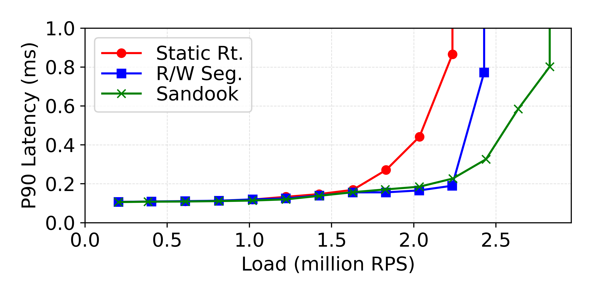
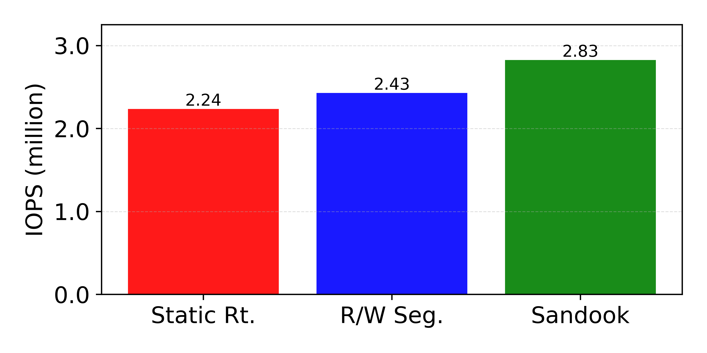
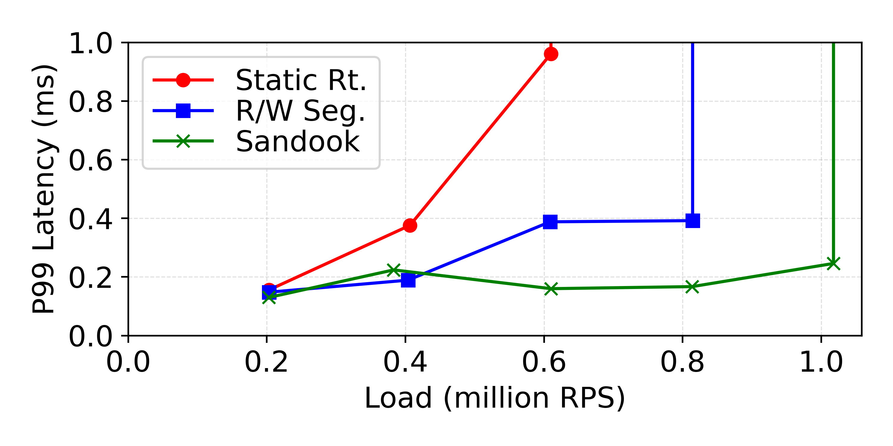
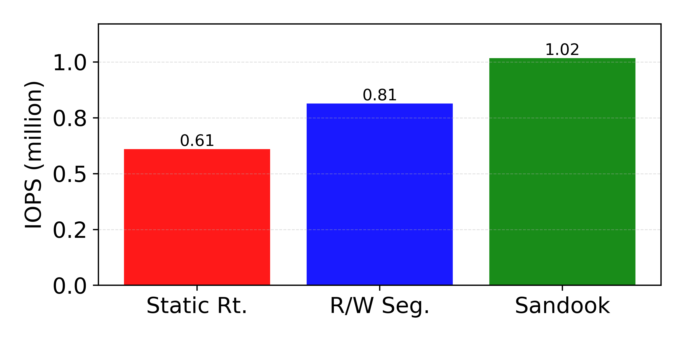

# exp_e2e sample outputs

This directory contains the end-to-end experiment (`exp_e2e`) configs and a
checked-in set of sample outputs under `sample_output/`.

## Sample plots

All plots below are from `sample_output/`.

### P90 load–latency curve

### P90 throughput (best IOPS under latency bound)

### P99 load–latency curve

### P99 throughput (best IOPS under latency bound)

