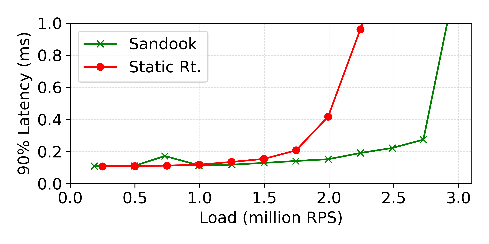
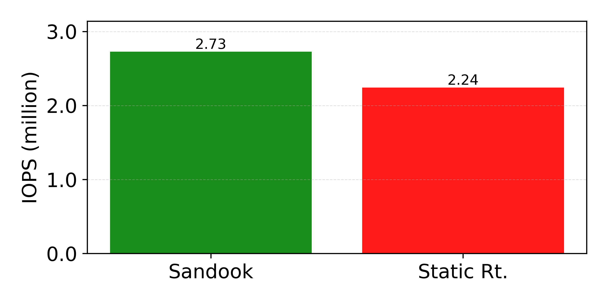
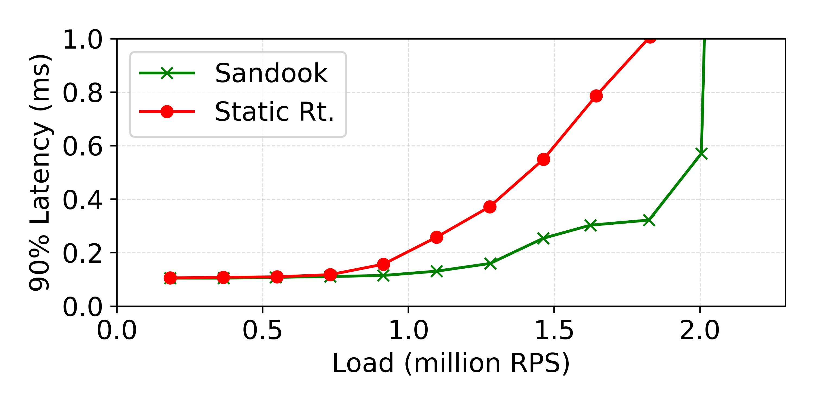
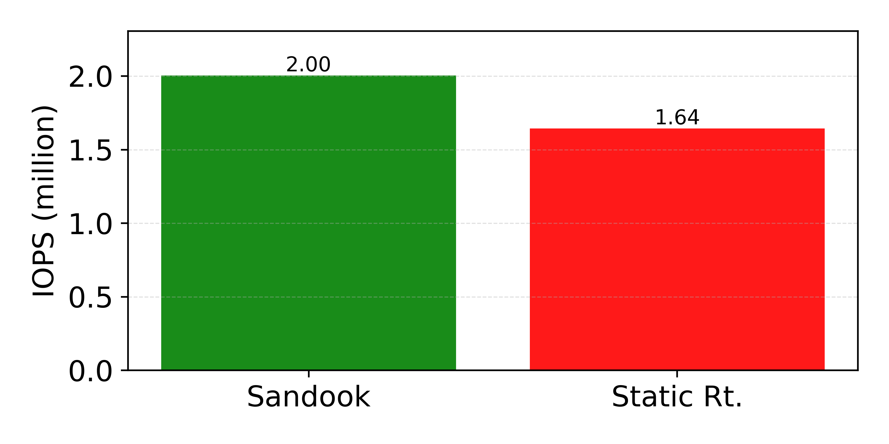
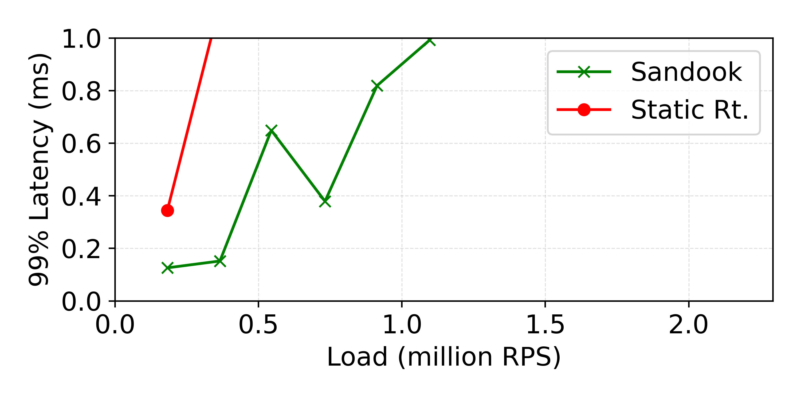
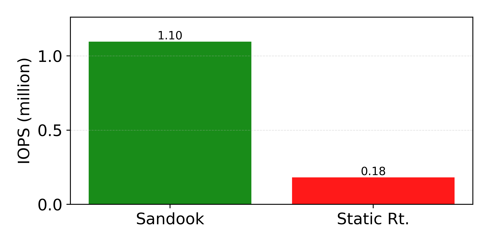
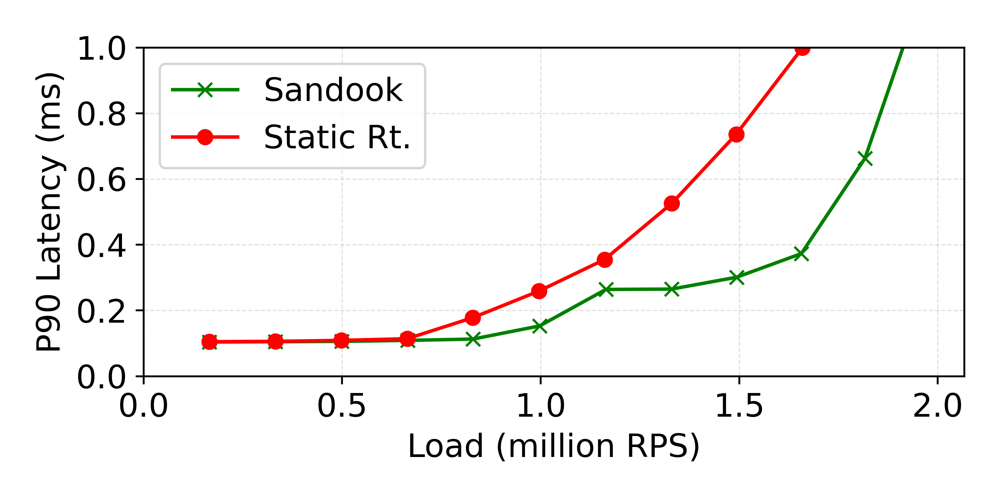
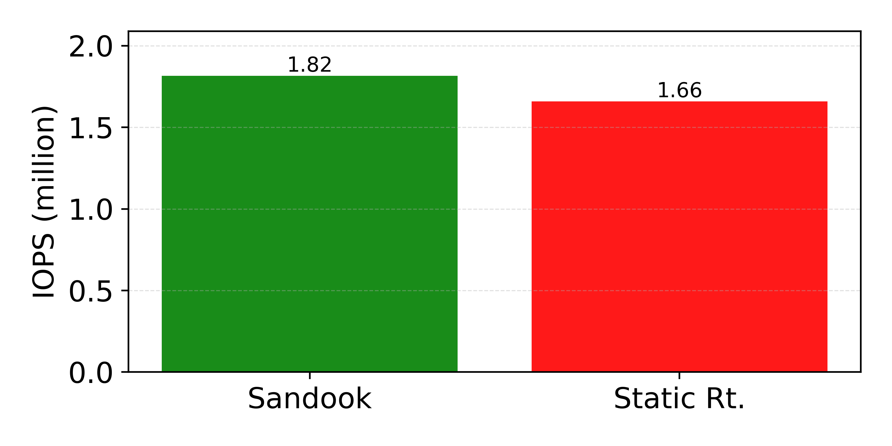
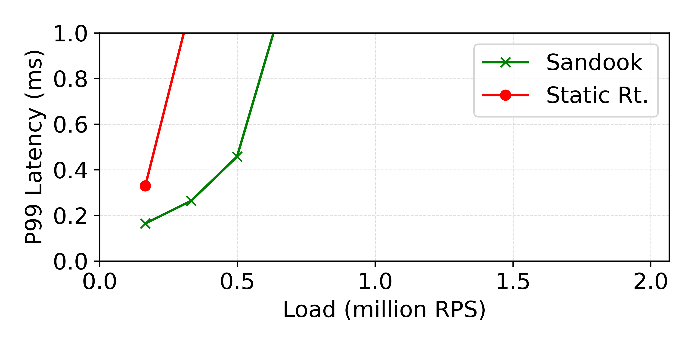
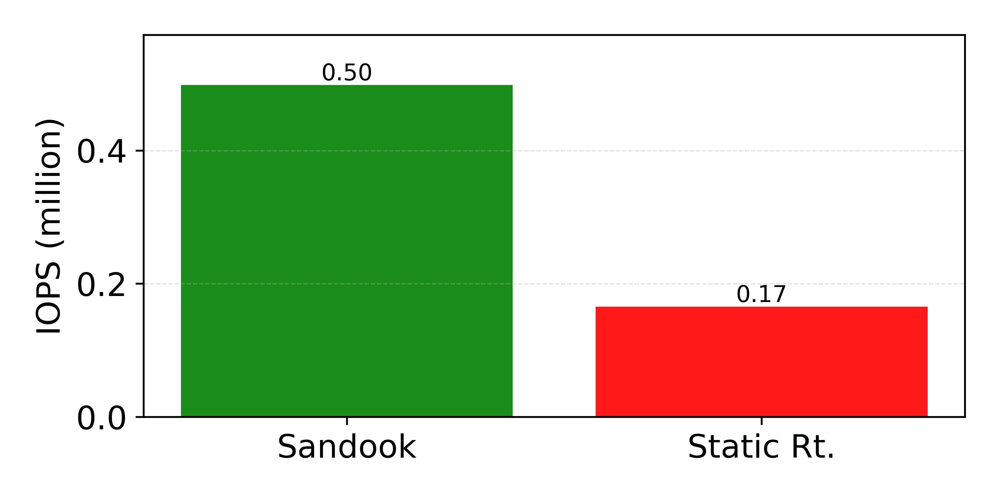

# exp_rw_ratio sample outputs

This directory contains the read/write-ratio experiment configs (`exp_rw_ratio`)
and checked-in sample outputs under:

- `sample_output_100w/`
- `sample_output_300w/`
- `sample_output_500w/`

## Sample plots

### 100w (10% writes)

**P90 load–latency curve**

**P90 throughput (best IOPS under latency bound)**

### 300w (30% writes)

**P90 load–latency curve**

**P90 throughput (best IOPS under latency bound)**

**P99 load–latency curve**

**P99 throughput (best IOPS under latency bound)**

### 500w (50% writes)

**P90 load–latency curve**

**P90 throughput (best IOPS under latency bound)**

**P99 load–latency curve**

**P99 throughput (best IOPS under latency bound)**

